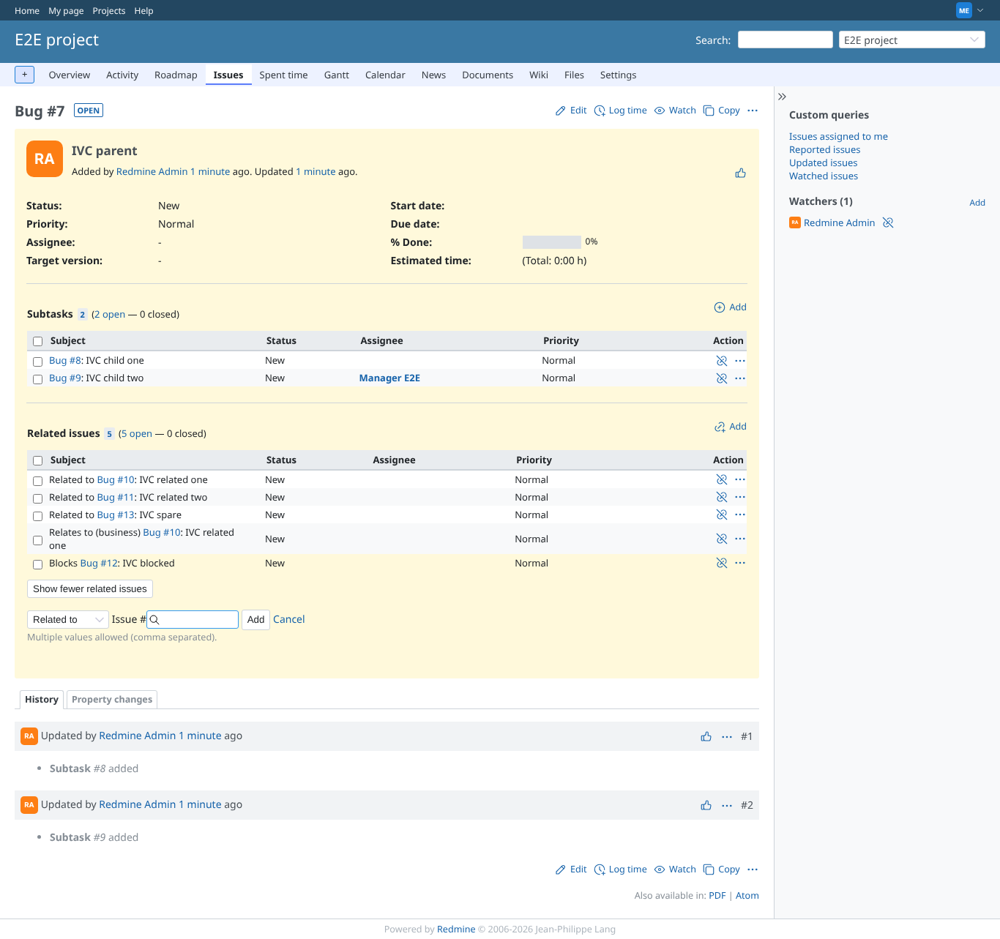
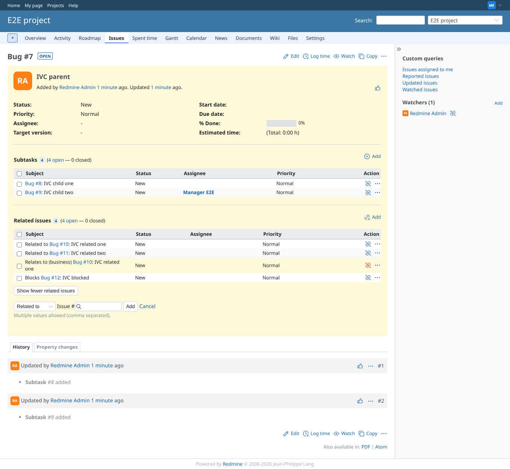
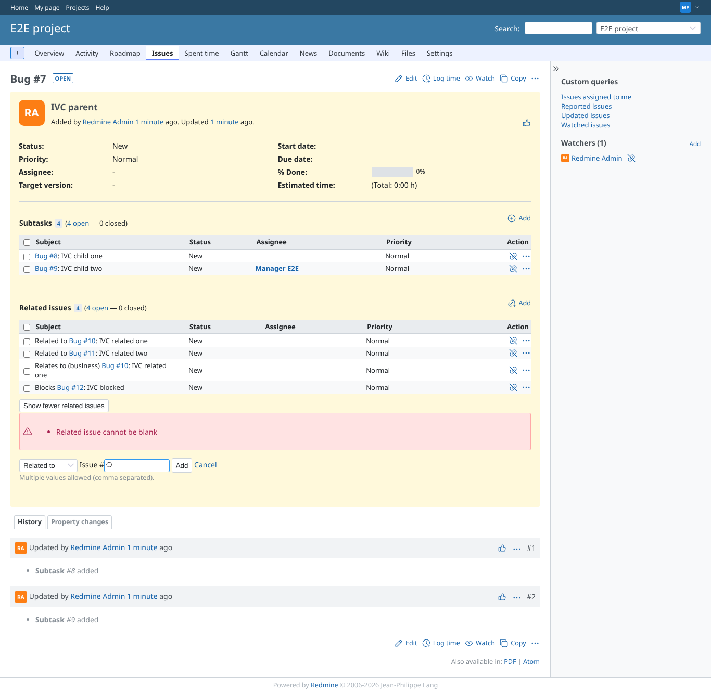

# ajax_relations

Run 2026-10-06T22:27:48.418Z against http://127.0.0.1:3000.

| screenshot | user | URL | shows |
|---|---|---|---|
|  | manager | `/issues/7` | Relation added by AJAX: plugin table with 5 rows, 5 visible, button "Show fewer related issues" |
|  | manager | `/issues/7` | Relation removed through the icon (confirmed): row gone, 4 left |
|  | manager | `/issues/7` | Relating to #999999: the error is shown, the plugin table stays |
