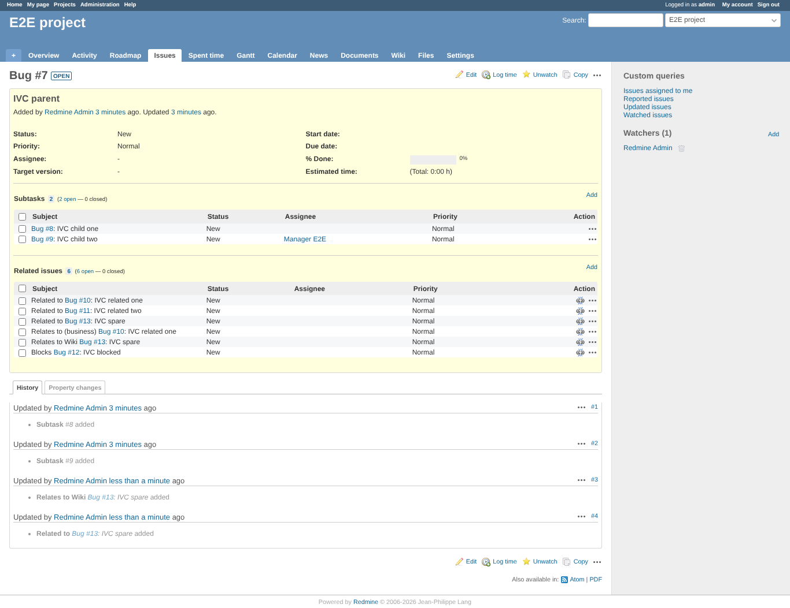

# rest_api

Run 2026-10-06T20:04:37.868Z against http://127.0.0.1:3001.

| screenshot | user | URL | shows |
|---|---|---|---|
|  | admin | `/issues/7` | Relations created by the REST API: "Relates to Wiki" and "Related to" between #7 and the spare issue |

## Problems

- the API relation is not shown on the issue page
