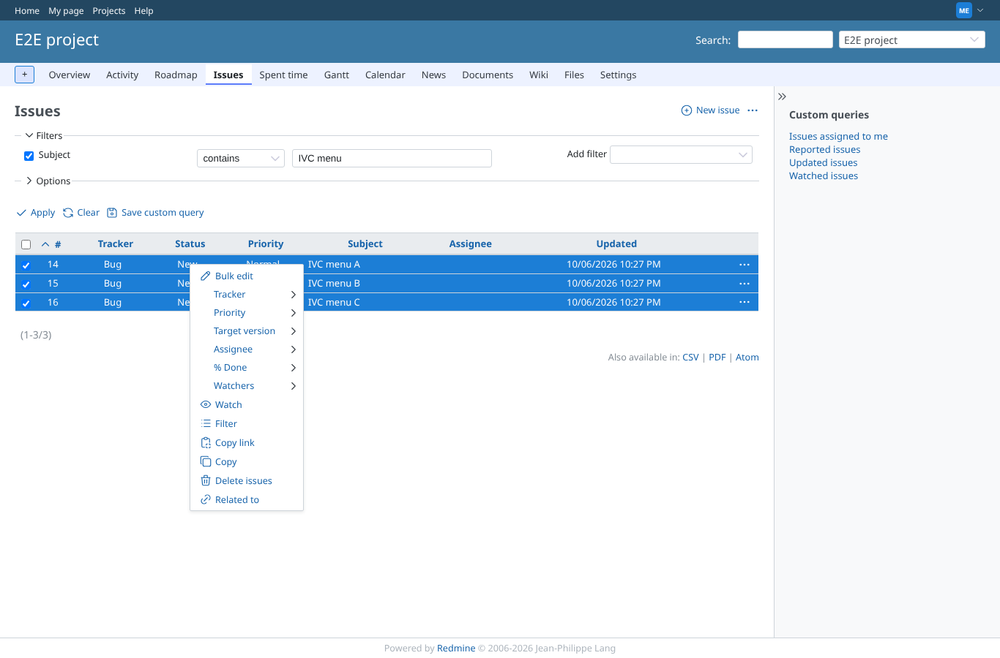
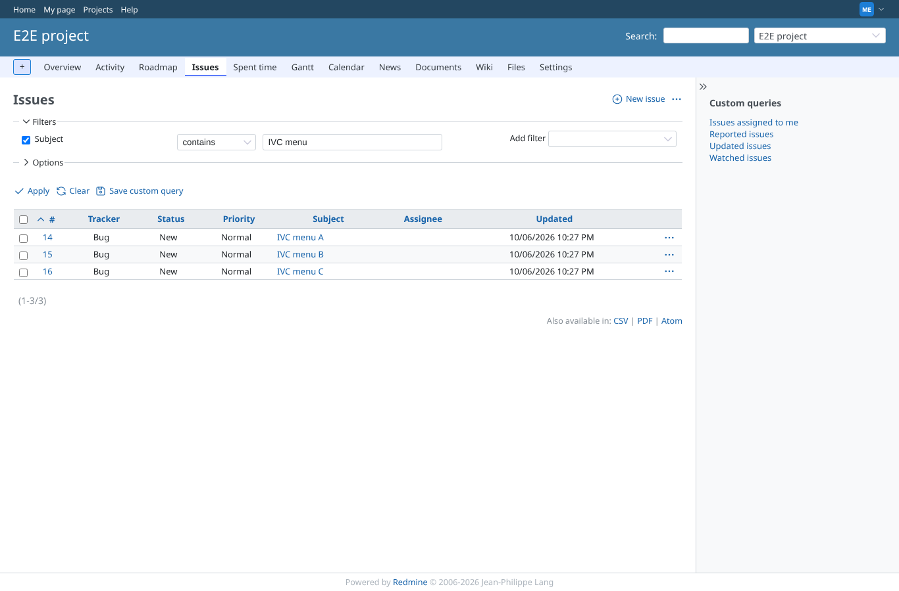
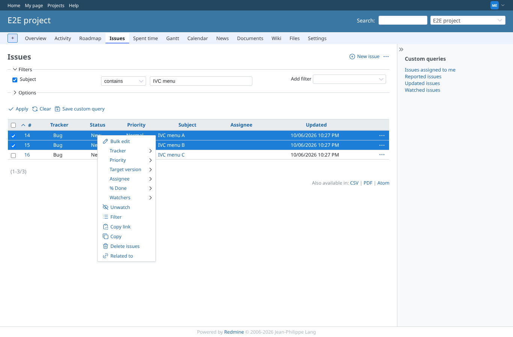
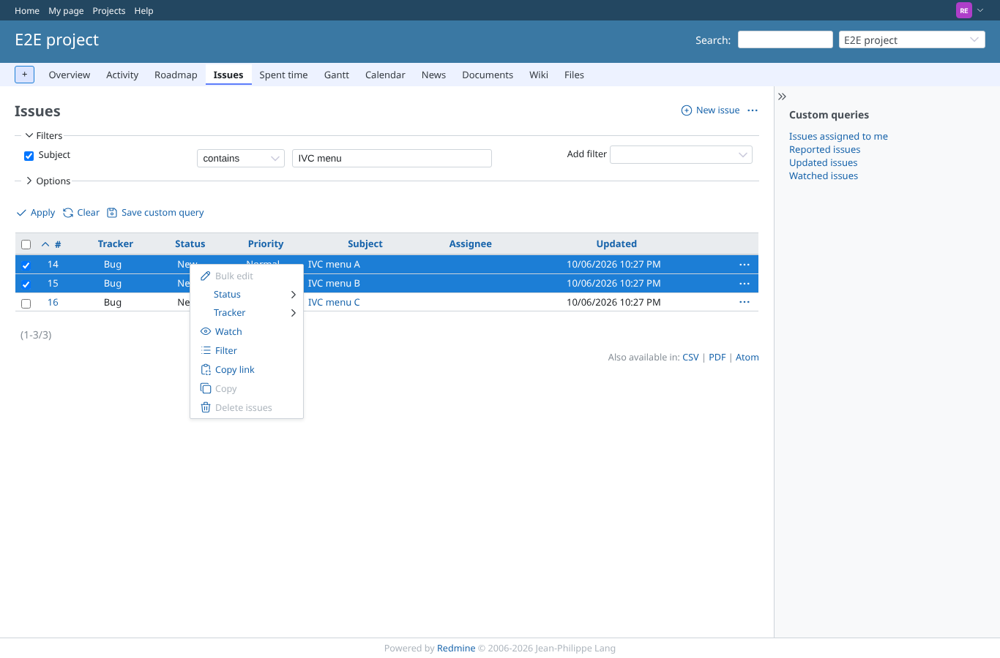
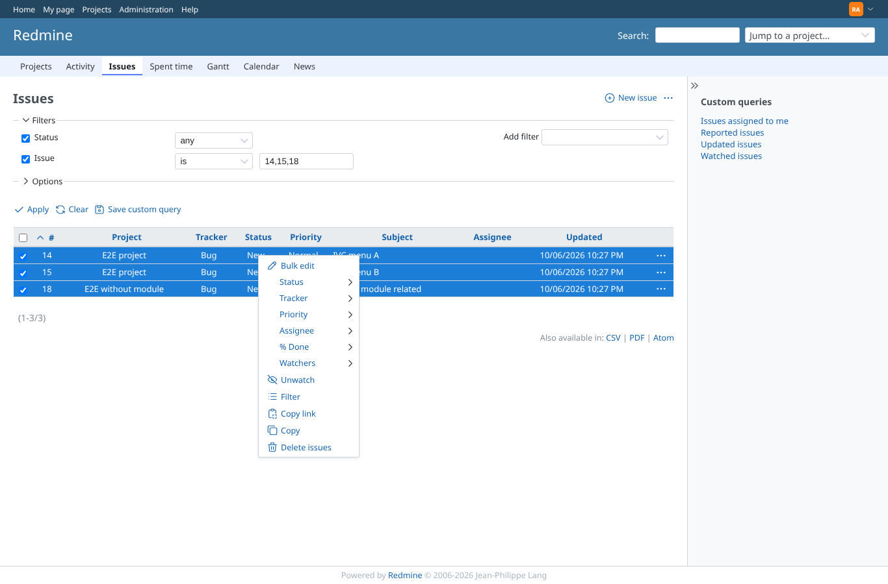
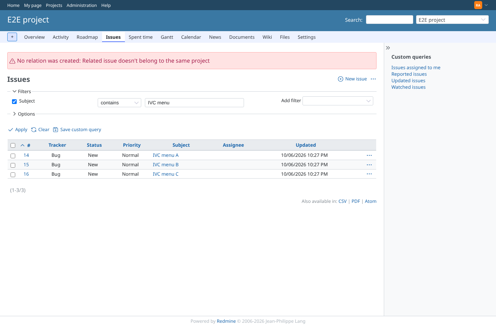

# context_menu

Run 2026-10-06T22:28:10.975Z against http://127.0.0.1:3000.

| screenshot | user | URL | shows |
|---|---|---|---|
|  | manager | `/projects/e2e-project/issues?set_filter=1&f[]=subject&op[subject]=~&v[subject][]=IVC+menu&sort=id` | Three unrelated issues selected: "Related to" with its link icon |
|  | manager | `/projects/e2e-project/issues?f%5B%5D=subject&op%5Bsubject%5D=~&set_filter=1&sort=id&v%5Bsubject%5D%5B%5D=IVC+menu` | After the click the list is shown again; A, B and C are related pairwise (3 relations) |
|  | manager | `/projects/e2e-project/issues?set_filter=1&f[]=subject&op[subject]=~&v[subject][]=IVC+menu&sort=id` | Every pair already related: "Related to" is not offered again |
|  | manager | `/projects/e2e-project/issues?set_filter=1&f[]=subject&op[subject]=~&v[subject][]=IVC+menu&sort=id` | Two related issues: "Remove relation" with its icon |
|  | manager | `/projects/e2e-project/issues?set_filter=1&f[]=subject&op[subject]=~&v[subject][]=IVC+menu&sort=id` | After removing, A and B can be related again |
|  | reporter | `/projects/e2e-project/issues?set_filter=1&f[]=subject&op[subject]=~&v[subject][]=IVC+menu&sort=id` | Reporter (no manage_issue_relations): neither entry in the menu |
|  | admin | `/issues?set_filter=1&f[]=status_id&op[status_id]=*&f[]=issue_id&op[issue_id]==&v[issue_id][]=14,15,18&sort=id` | Admin, issues of two projects, cross-project relations off: "Related to" is not offered |
|  | admin | `/projects/e2e-project/issues?set_filter=1&f[]=subject&op[subject]=~&v[subject][]=IVC+menu&sort=id` | A direct post with one cross-project pair creates nothing and says so |
