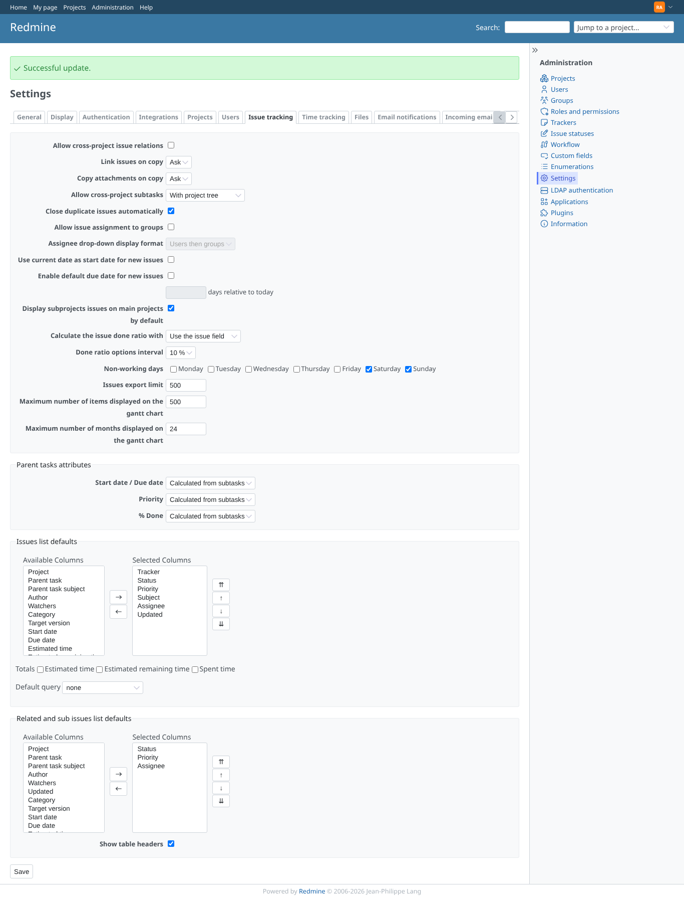
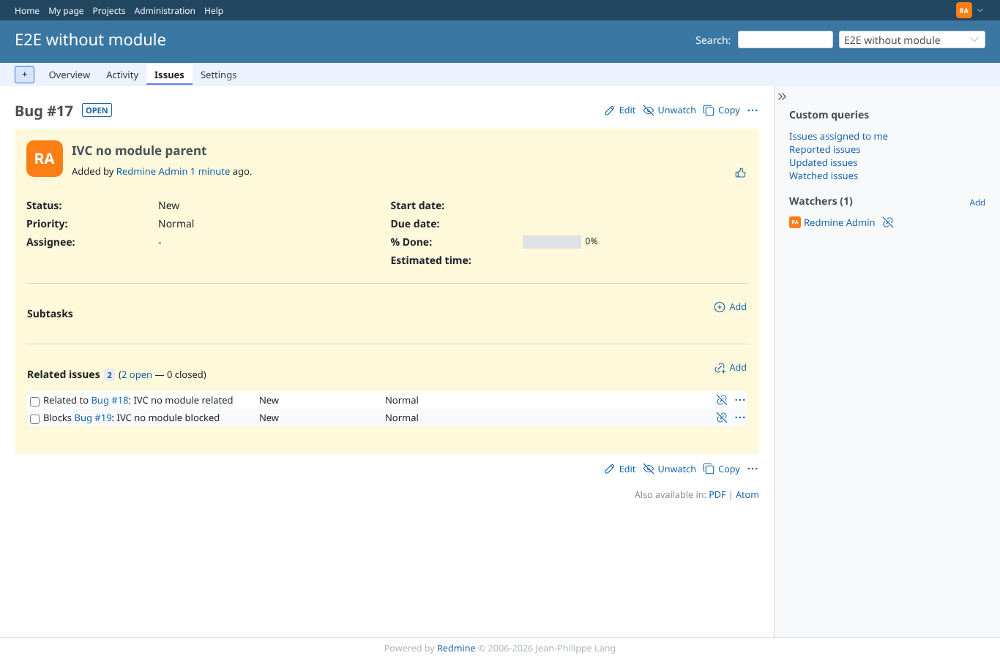

# global_defaults

Run 2026-10-06T22:28:30.469Z against http://127.0.0.1:3000.

| screenshot | user | URL | shows |
|---|---|---|---|
|  | admin | `/settings/plugin/redmine_issue_view_columns` | Plugin settings: columns now link to core's issue tracking settings; limit, grouping and relation types stay here |
|  | admin | `/issues/17` | Project without the module: the plugin table with core's columns Status, Priority |
|  | admin | `/settings?tab=issues` | Core setting "Related and sub issues list defaults" with Assignee added (Administration > Settings > Issue tracking) |
|  | admin | `/issues/17` | The project without the module follows core's setting: Assignee column added |
|  | admin | `/issues/17` | Core "Display table headers" off: the plugin table has no header row, like core's |
|  | admin | `/issues/17` | Global limit 1 and grouping: one row, the "Show all" button, headers per type |
|  | admin | `/issues/7` | A project with the module keeps its own settings: 4 rows, not grouped |
|  | manager | `/settings/plugin/redmine_issue_view_columns` | A non-administrator cannot open the plugin settings (403) |
