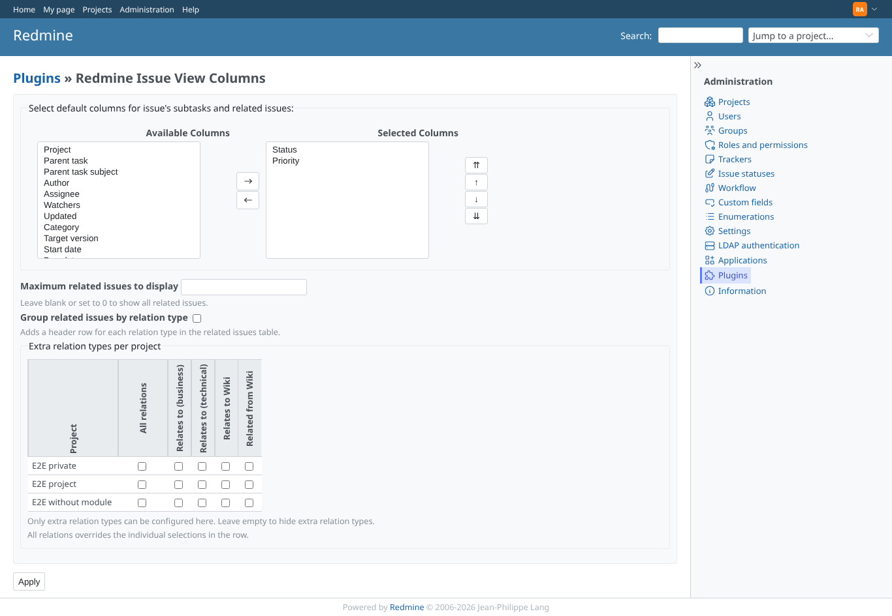
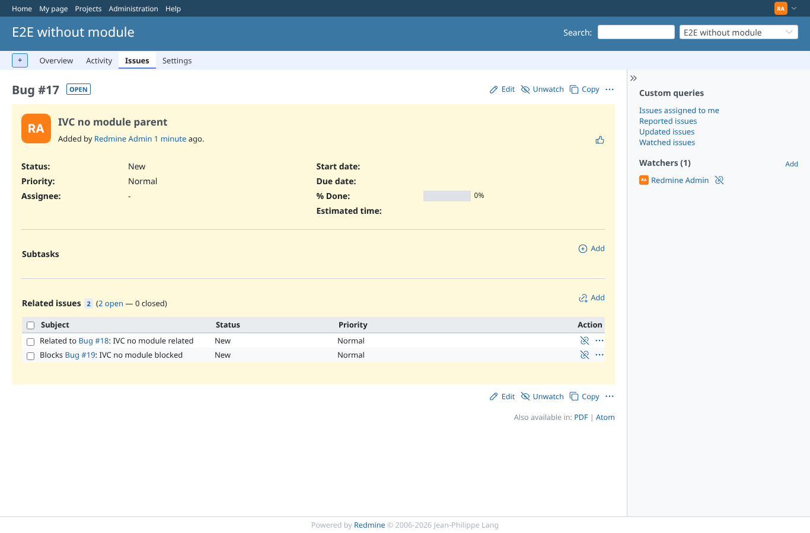
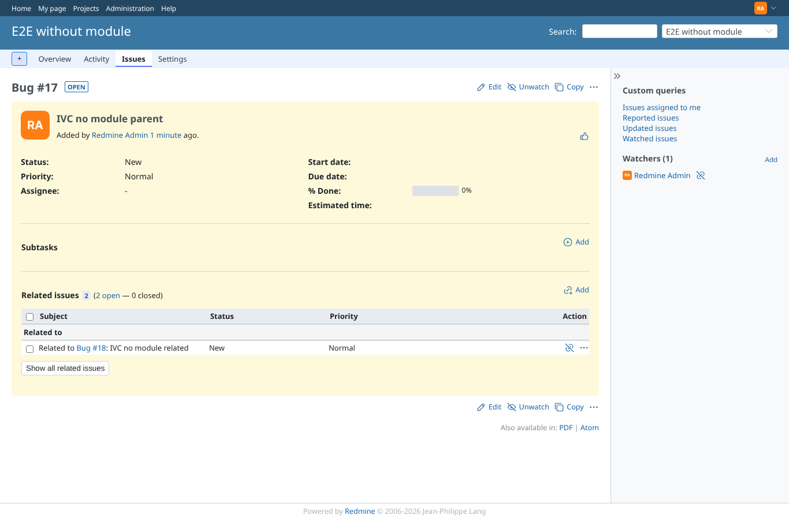
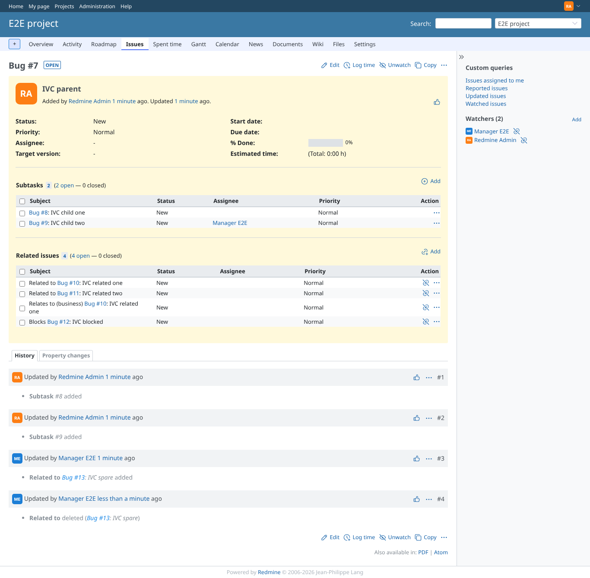

# global_defaults

Run 2026-10-06T19:47:17.995Z against http://127.0.0.1:3000.

| screenshot | user | URL | shows |
|---|---|---|---|
|  | admin | `/settings/plugin/redmine_issue_view_columns` | Plugin settings: default columns Status, Priority; limit; grouping; extra relation types per project |
|  | admin | `/issues/17` | Project without the module uses the global columns Status, Priority |
|  | admin | `/issues/17` | Global limit 1 and grouping: one row, the "Show all" button, headers per type |
|  | admin | `/issues/7` | A project with the module keeps its own settings: 4 rows, not grouped |
|  | manager | `/settings/plugin/redmine_issue_view_columns` | A non-administrator cannot open the plugin settings (403) |
