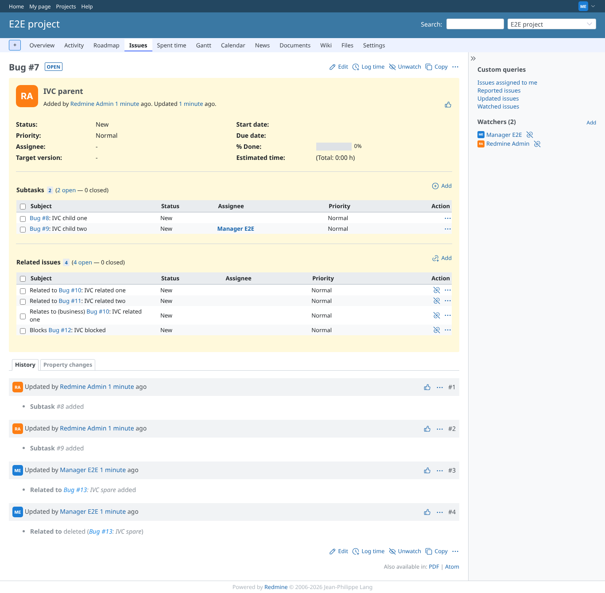
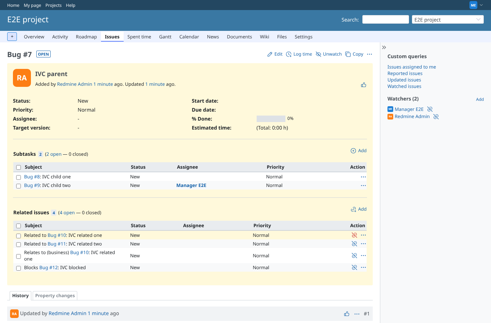
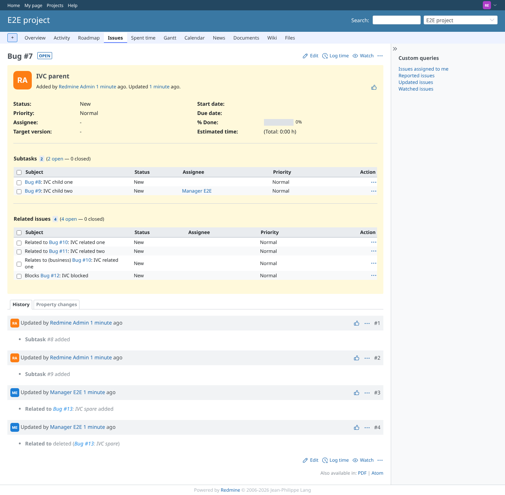
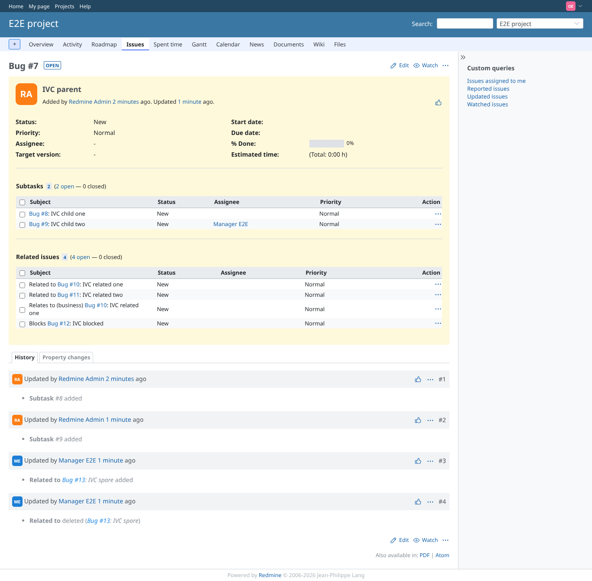

# issue_tables

Run 2026-10-06T19:47:27.676Z against http://127.0.0.1:3000.

| screenshot | user | URL | shows |
|---|---|---|---|
|  | manager | `/issues/7` | Manager: subtasks and related issues with Status, Assignee, Priority; an SVG "Remove relation" icon per relation; two relates-like types between #7 and #10 (unique index per type) |
|  | manager | `/issues/7` | Hovering the remove icon highlights it (title "Remove relation", label hidden as in core) |
|  | reporter | `/issues/7` | Reporter (no manage_issue_relations): same columns, no remove icons, only the actions menu |
|  | outsider | `/issues/7` | Outsider on the public project: columns shown read-only |
|  | outsider | `/issues/20` | Outsider: an issue of the private project is refused (403) |
