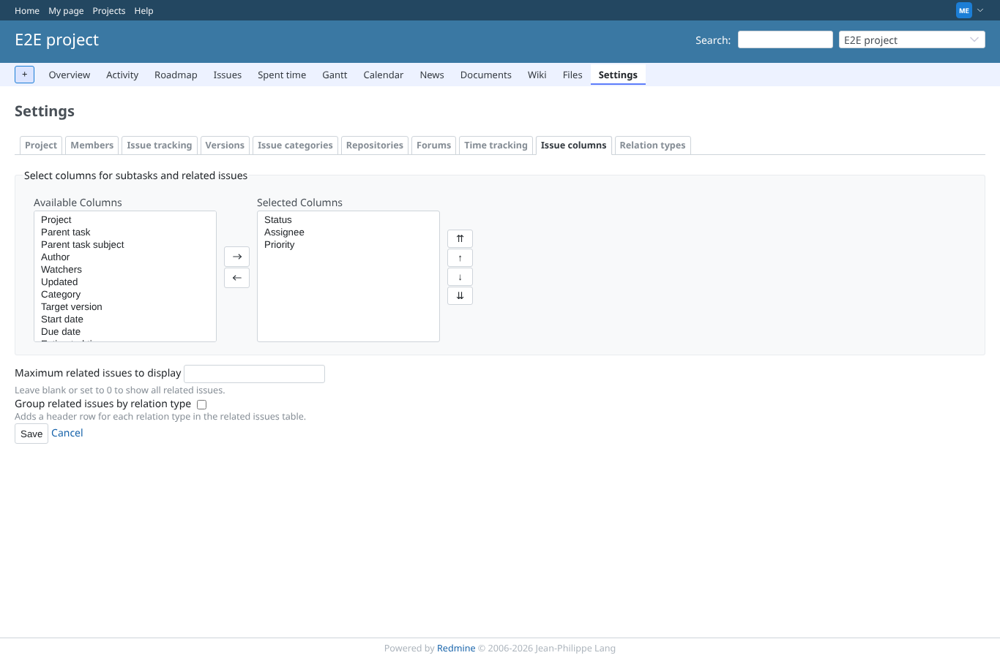
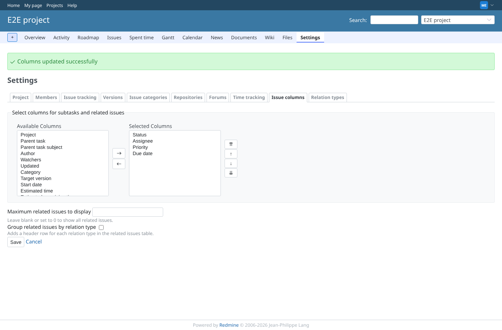
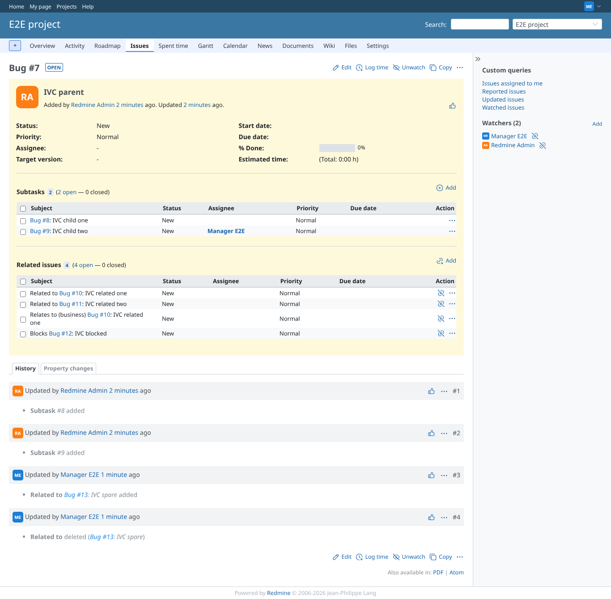
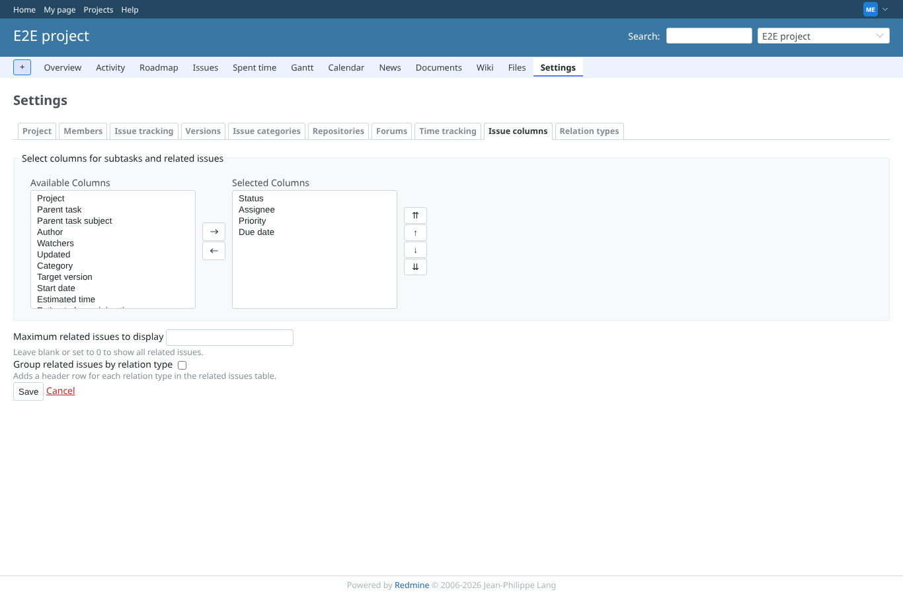
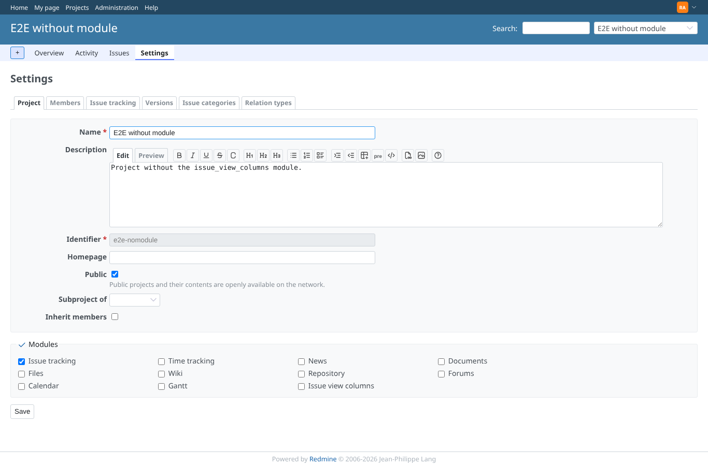

# project_columns

Run 2026-10-06T19:47:46.228Z against http://127.0.0.1:3000.

| screenshot | user | URL | shows |
|---|---|---|---|
|  | manager | `/projects/e2e-project/settings/issue_view_columns` | Project tab "Issue columns" as manager: selector side by side, limit, grouping, Save and a Cancel link |
|  | manager | `/projects/e2e-project/settings/issue_view_columns` | After Save: notice, and Due date is a selected column |
|  | manager | `/issues/7` | The issue shows the new Due date column in subtasks and related issues |
|  | manager | `/projects/e2e-project/settings/issue_view_columns` | Cancel leaves the tab without saving: the limit is still empty |
|  | reporter | `/projects/e2e-project/settings` | Reporter (no plugin permission, no settings permission): project settings refused |
|  | admin | `/projects/e2e-nomodule/settings` | Module disabled (e2e-nomodule, admin): no "Issue columns" tab |
|  | manager | `/projects/e2e-project/settings/issue_view_columns` | After the refused posts the project keeps its 3 columns and no limit |
