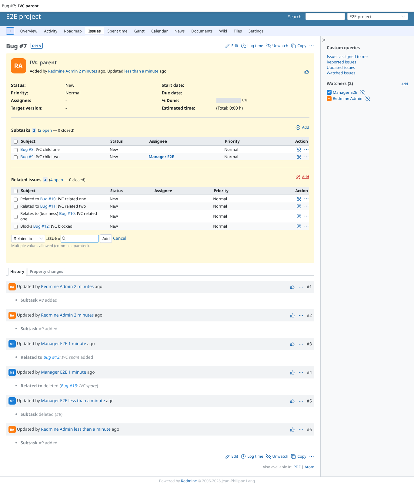
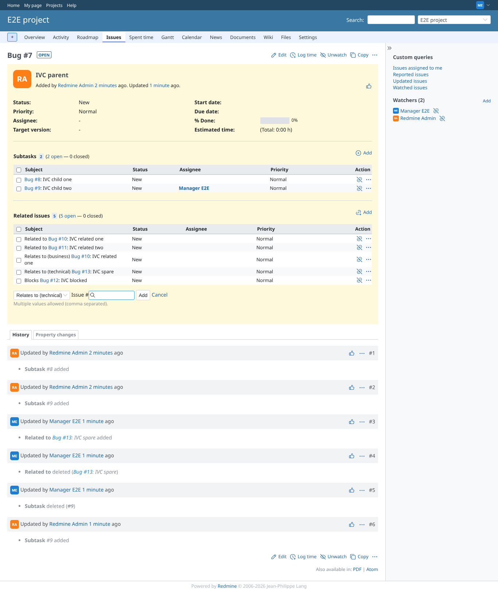
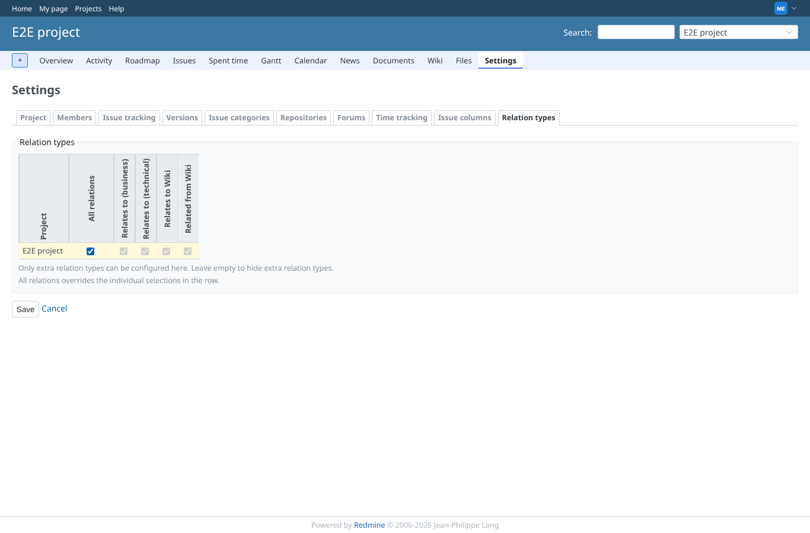
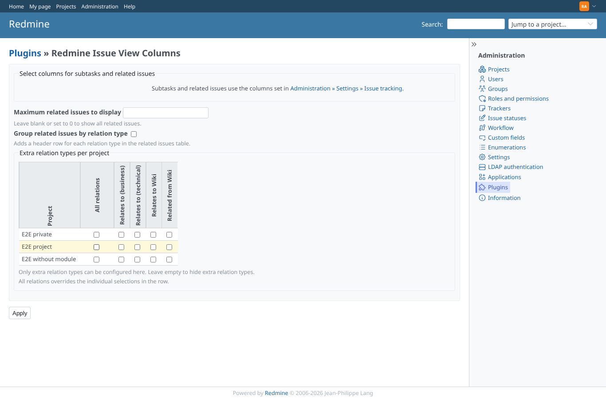
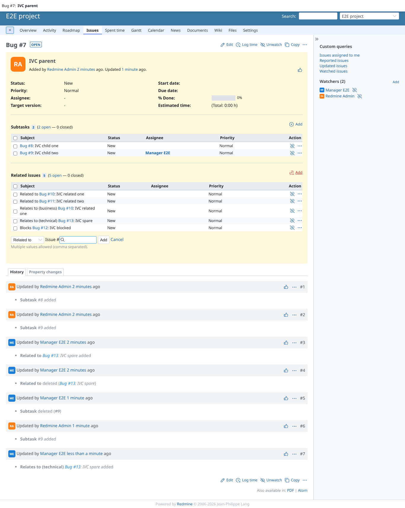

# relation_types

Run 2026-10-06T22:29:20.521Z against http://127.0.0.1:3000.

| screenshot | user | URL | shows |
|---|---|---|---|
|  | manager | `/issues/7` | By default "Add relation" offers only the core relation types |
|  | manager | `/projects/e2e-project/settings/issue_view_columns_relations` | Project tab "Relation types": Relates to (technical) selected |
|  | manager | `/issues/7` | A "Relates to (technical)" relation added through the form, shown in the plugin table |
|  | manager | `/projects/e2e-project/settings/issue_view_columns_relations` | "All relations" checks and locks every extra type |
|  | admin | `/settings/plugin/redmine_issue_view_columns` | Administrator matrix: E2E project row cleared before Apply |
|  | manager | `/issues/7` | Types hidden again: the dropdown is back to core, existing relations of that type stay listed |
|  | reporter | `/projects/e2e-project/settings/issue_view_columns_relations` | Reporter: the relation types tab is refused (403), a direct POST too |
