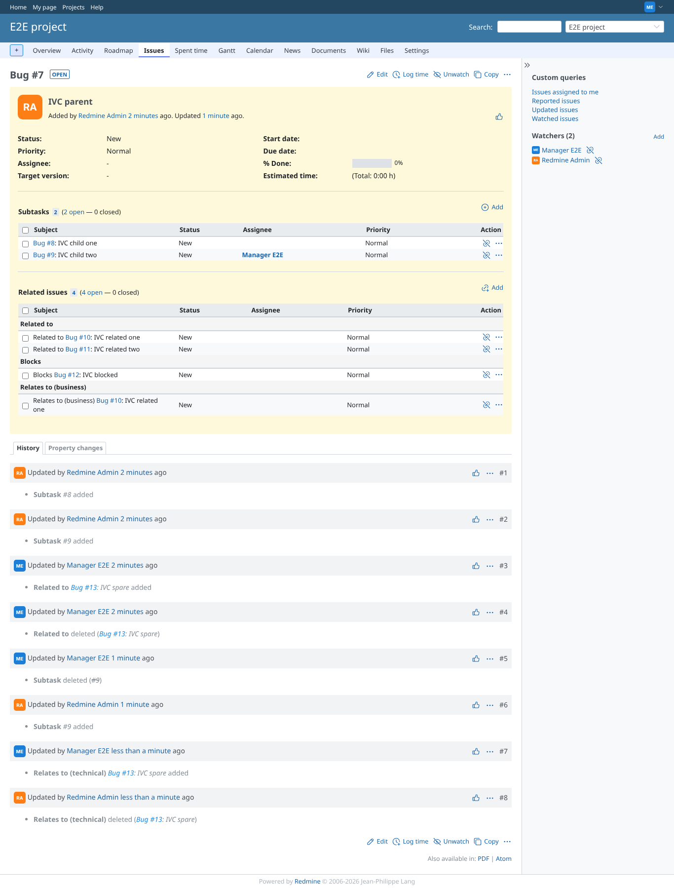
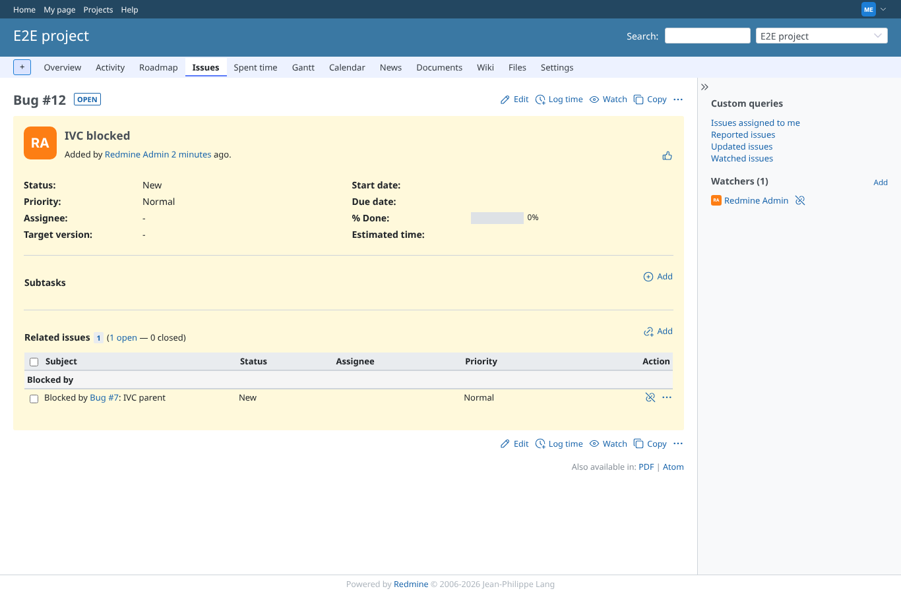
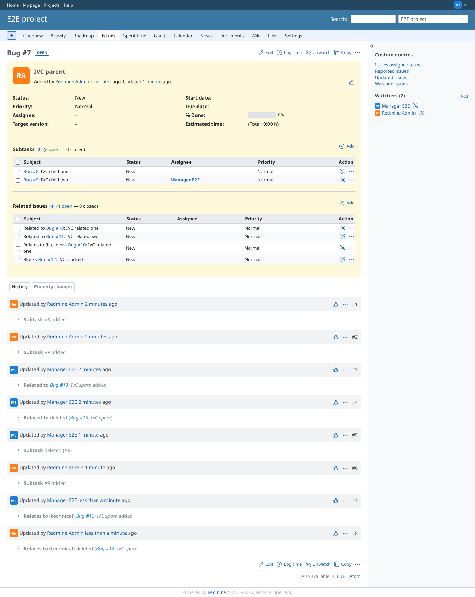

# relations_grouping

Run 2026-10-06T22:29:30.128Z against http://127.0.0.1:3000.

| screenshot | user | URL | shows |
|---|---|---|---|
|  | manager | `/issues/7` | Grouped: "Related to" (2), "Blocks" (1), "Relates to (business)" (1) |
|  | manager | `/issues/12` | From the other side the group is the reverse type "Blocked by" |
|  | manager | `/issues/7` | Grouping off: one list without headers |
