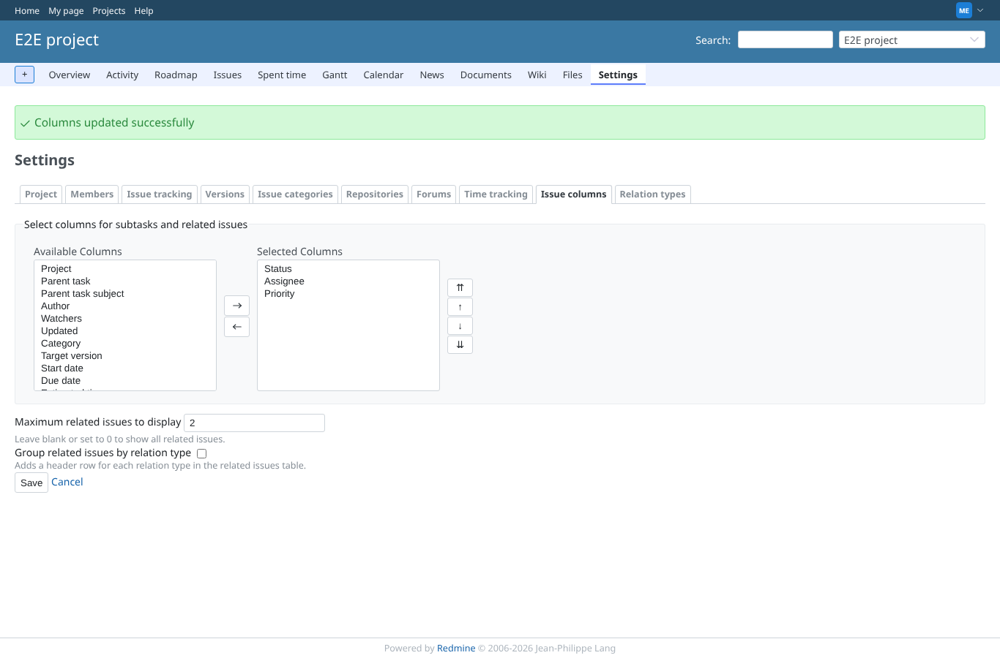
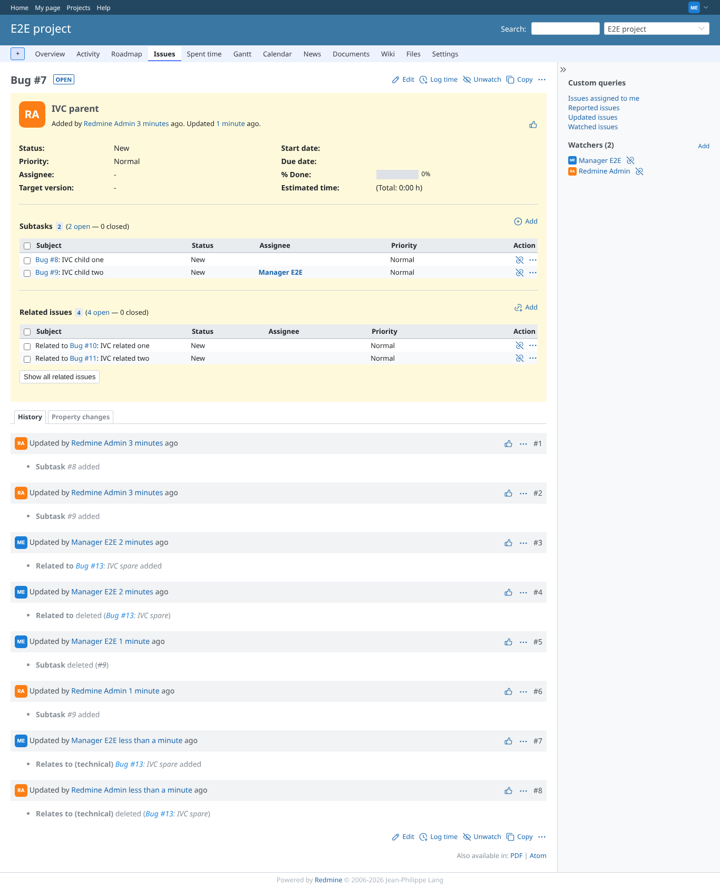
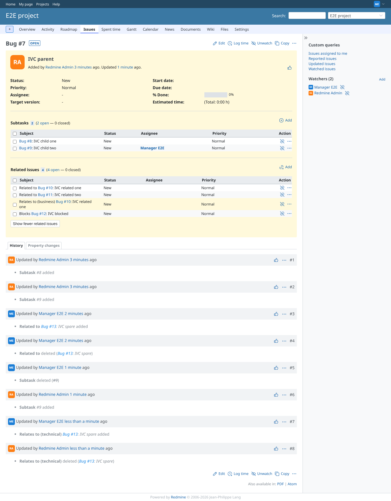
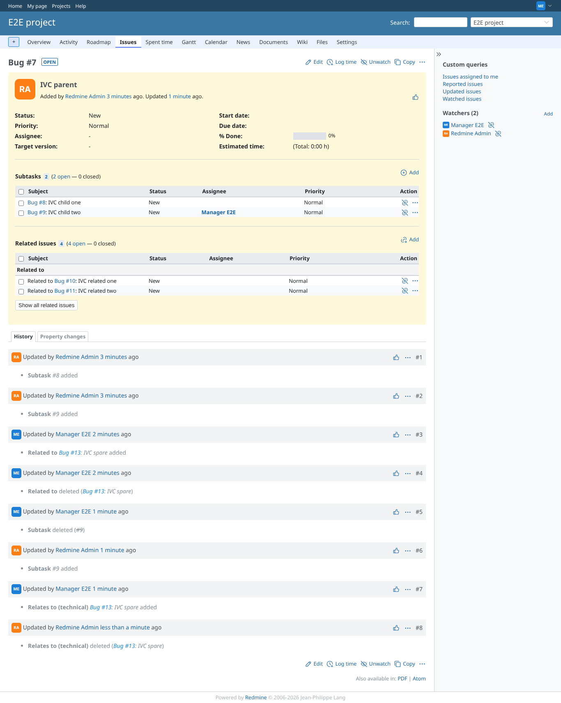
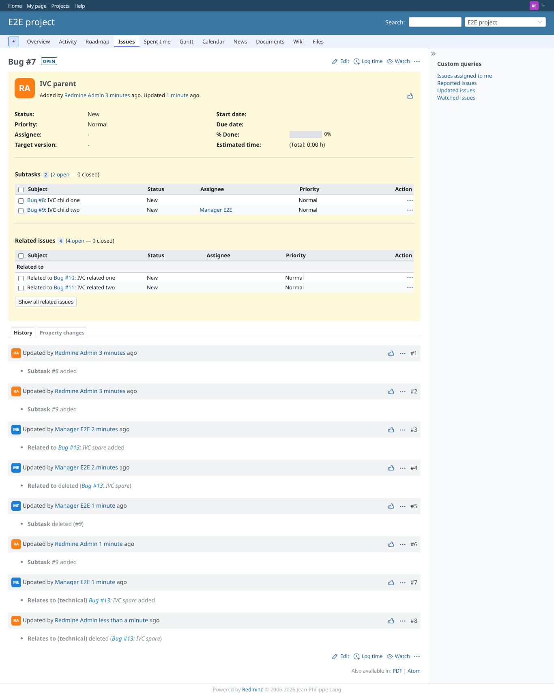
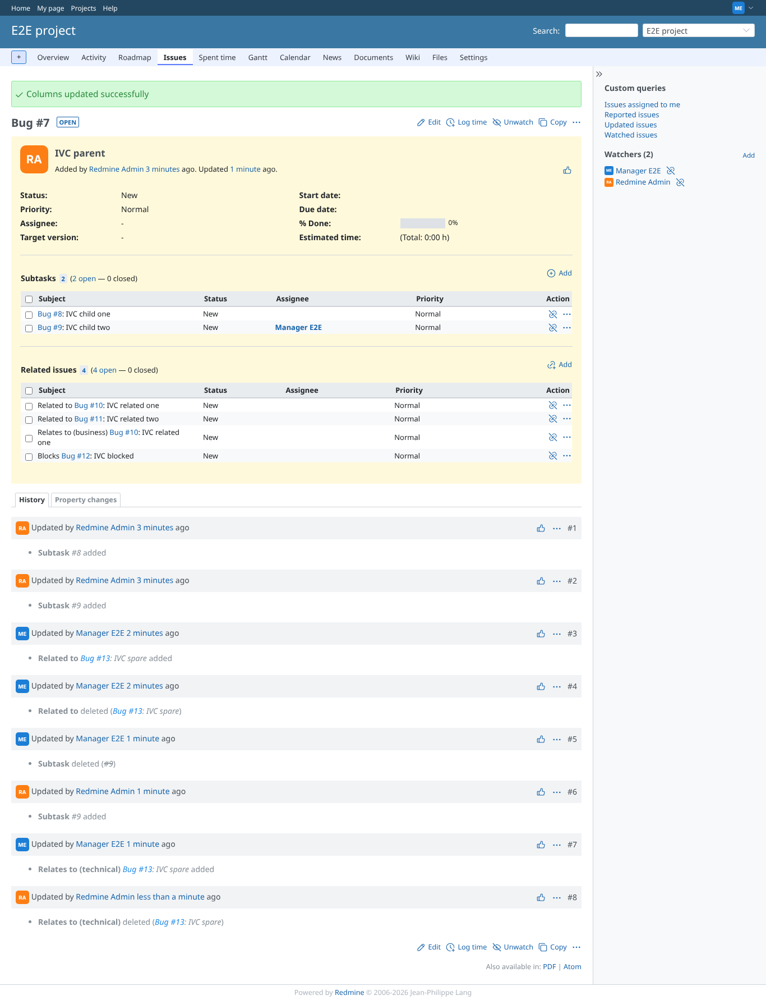
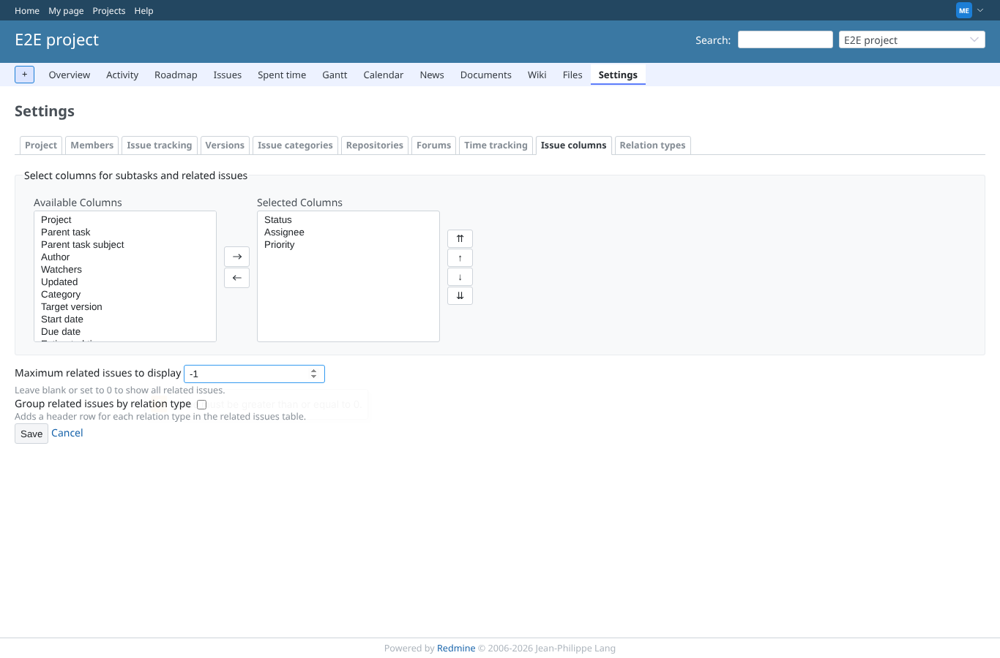

# relations_limit

Run 2026-10-06T22:29:49.404Z against http://127.0.0.1:3000.

| screenshot | user | URL | shows |
|---|---|---|---|
|  | manager | `/projects/e2e-project/settings/issue_view_columns` | Project tab: limit 2, not grouped, saved |
|  | manager | `/issues/7` | Limit 2 of 4, not grouped: 2 rows and "Show all related issues" |
|  | manager | `/issues/7` | After the click: all 4 rows and "Show fewer related issues" |
|  | manager | `/issues/7` | Limit 2, grouped: headers of fully hidden groups are hidden too |
|  | reporter | `/issues/7` | Reporter: the same limit and button |
|  | manager | `/issues/7` | Limit "-3", "abc" or "0" posted: stored as no limit, all 4 rows, no button |
|  | manager | `/projects/e2e-project/settings/issue_view_columns` | The form refuses a negative limit (min 0) before it is sent |
